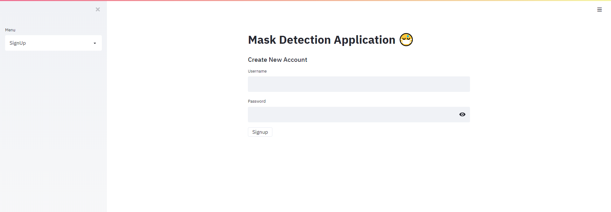
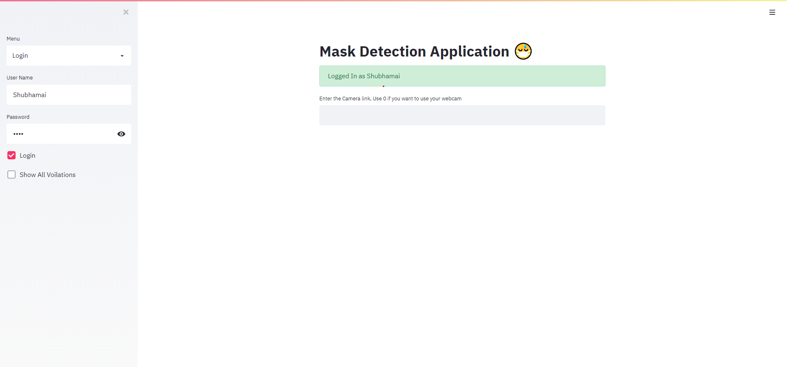

# Mask Detection Application 😷 

The Application allows you to monitor people with no mask and save their images with login/signup functionality

# About 
In this *corona time* there are very few or no applications which allows you to moniter/record the people with mask/no mask and saving the picture with respective date and time for further actions. 

This is exactly what this application offers with signup/login funcnality so that only certain people can see their relevent records. 

So, here are all the feature in this application -

- Using any kinds of camera link, you can moniter live with people having mask or not. 
- The program will automatically saves & shows the picture of people with not mask.
- You can see all people with no mask with recpective time & dates.

# Built With 
- [Streamlit](https://www.streamlit.io/) - The completele fronted is based on React Web Application, and streamlit allows to make React Web Application completely in Python 🎉.  
- [Sqlite3](https://www.sqlite.org/index.html) - For saving the user data in a database ( username & password )
- [Tensorflow](https://www.tensorflow.org/) & [OpenCV](https://opencv.org/) - To detct faces & mask in **real-time**
And bunch of other small libraries including os, time, numpy. 

# Getting Started

Below are the steps to run the application in your PC or laptop, whatever. 

##  Prerequisites

The code has only been tested on Python 3.7.7 so it's recommended
- Python 3.x - You can download python in [Official Python Site](https://www.python.org/).   

## Installation

### Through Github 

1. Clone the repo using `git clone https://github.com/Shubhamai/mask-detector-app.git`
2. Open the terminal and run `pip install -r requirements.txt`
3. Run `streamlit run app.py`
4. Enjoy 🎊

### Docker 🐳

The docker image is avalible in the [docker hub](https://hub.docker.com/r/shubhamai/maskapp). 

# Usage

You will need to first signup to the application, use whatever email or password and then hit signup. 

Another main thing is that **The passwords are firstly being hashed and then stored, password are not being stored in raw format.**

And then just login to the application, enter your camera link, ( if you are using a webcam or something, just enter 0)

And there you goo 🎉

With clicking on the Violations, you will see all the pictures of people with no mask with respective date & time

# License 
Distributed under the GNU General Public License v3.0. See `LICENSE` for more information.

# Contact

Shubhamai - [@Shubhamai](https://twitter.com/Shubhamai) - shubham.aiengineer@gmail.com

Project Link: https://github.com/Shubhamai/mask-detector-app

